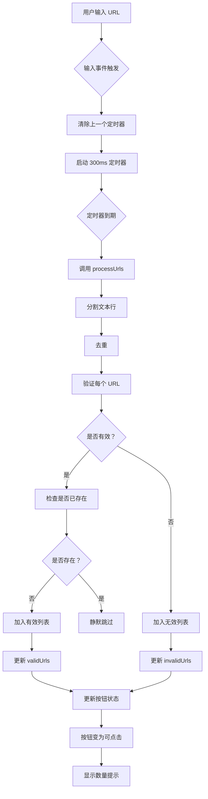

# 🔧 网络图片上传功能 - Bug 修复报告

## 📋 问题描述

**用户反馈**：
- 输入链接 `https://qncdn-file.zhaomi.cn/0721d4fb3c4d0c4f138e6708c4cf1aca016181c9.jpg` 
- "确认添加"按钮不可点击（disabled 状态）
- 按钮没有显示数量（如"确认添加 (1 张)"）

---

## 🔍 问题分析

### 根本原因

在原始实现中，`NetworkImageModal.vue` 组件缺少**自动验证机制**：

1. **验证触发时机不对**
   - `processUrls()` 函数只在点击"确认添加"时才被调用
   - 用户输入 URL 后，没有自动触发验证
   - `validUrls` 数组保持为空，导致按钮禁用

2. **用户反馈缺失**
   - 输入 URL 后，界面上没有任何提示
   - 无法看到有效/无效 URL 的数量
   - 按钮状态不正确

### 代码问题

```javascript
// ❌ 原始代码：只在确认时验证
const handleConfirm = async () => {
  await processUrls() // 此时才第一次验证
  // ...
}

// 缺少输入时的自动验证
```

---

## ✅ 解决方案

### 1. 添加输入监听和防抖验证

**修改文件**：`src/components/modals/NetworkImageModal.vue`

#### 添加 `@input` 事件监听
```vue
<textarea
  v-model="inputText"
  @input="handleInput"
  <!-- 其他属性... -->
></textarea>
```

#### 实现防抖验证函数
```javascript
// 防抖定时器
let debounceTimer = null

// 处理输入变化（带防抖的自动验证）
const handleInput = () => {
  // 清除之前的定时器
  if (debounceTimer) {
    clearTimeout(debounceTimer)
  }
  
  // 设置新的定时器，延迟 300ms 验证
  debounceTimer = setTimeout(() => {
    processUrls()
  }, 300)
}
```

### 2. 优化拖拽后的验证

```javascript
const handleTextDrop = (event) => {
  const text = event.dataTransfer.getData('text/plain')
  if (text) {
    const urlRegex = /(https?:\/\/[^\s]+)/g
    const matches = text.match(urlRegex) || []
    
    if (matches.length > 0) {
      inputText.value = matches.join('\n')
      handleInput() // ✅ 立即触发验证
    } else {
      inputText.value = text
      handleInput() // ✅ 立即触发验证
    }
  }
}
```

### 3. 清理定时器

```javascript
const closeModal = () => {
  // 清除防抖定时器，防止内存泄漏
  if (debounceTimer) {
    clearTimeout(debounceTimer)
  }
  emit('close')
}
```

---

## 🎯 修复效果

### 修复前
```
用户输入 URL → 无任何反应 → 按钮禁用 → 无法添加
```

### 修复后
```
用户输入 URL → 等待 300ms → 自动验证 → 更新状态 → 按钮可点击 → 显示数量
```

---

## 📊 验证流程

### 自动验证流程图



---

## 🧪 测试验证

### 测试用例 1：单个 URL 输入

**输入**：
```
https://qncdn-file.zhaomi.cn/0721d4fb3c4d0c4f138e6708c4cf1aca016181c9.jpg
```

**预期结果**：
- ✅ 输入后 300ms 自动验证
- ✅ 按钮显示"确认添加 (1 张)"
- ✅ 按钮变为可点击状态
- ✅ 无错误提示

### 测试用例 2：批量粘贴

**输入**：
```
https://example.com/img1.jpg
https://example.com/img2.png
https://example.com/img3.gif
```

**预期结果**：
- ✅ 自动验证所有 3 个 URL
- ✅ 按钮显示"确认添加 (3 张)"
- ✅ 如果都有效，无错误提示

### 测试用例 3：混合有效和无效

**输入**：
```
https://example.com/img1.jpg
not-a-url
https://example.com/img2.png
```

**预期结果**：
- ✅ 自动验证
- ✅ 显示红色警告区域："以下链接格式无效（1 个）"
- ✅ 列出 `not-a-url`
- ✅ 按钮显示"确认添加 (2 张)"

### 测试用例 4：重复 URL

**输入**：
```
https://example.com/img1.jpg
https://example.com/img1.jpg
https://example.com/img2.png
```

**预期结果**：
- ✅ 自动去重
- ✅ 按钮显示"确认添加 (2 张)"
- ✅ 不显示重复警告（静默处理）

---

## 🎨 UI 状态变化

### 输入过程中的状态

| 时间点 | validUrls | invalidUrls | 按钮状态 | 按钮文字 |
|--------|-----------|-------------|----------|----------|
| 初始 | `[]` | `[]` | 禁用 | "确认添加" |
| 输入第 1 个字符 | `[]` | `[]` | 禁用 | "确认添加" |
| 输入完成（<300ms） | `[]` | `[]` | 禁用 | "确认添加" |
| 输入完成（≥300ms） | `['url1']` | `[]` | ✅ 可点击 | "确认添加 (1 张)" |
| 输入无效 URL | `[]` | `['bad']` | 禁用 | "确认添加" |
| 混合输入 | `['url1']` | `['bad']` | ✅ 可点击 | "确认添加 (1 张)" |

---

## 📝 代码变更摘要

### 修改的文件

**`src/components/modals/NetworkImageModal.vue`**

#### 模板部分
```diff
+ @input="handleInput"
```

#### 脚本部分
```diff
+ // 防抖定时器
+ let debounceTimer = null
+ 
+ // 处理输入变化（带防抖的自动验证）
+ const handleInput = () => {
+   if (debounceTimer) {
+     clearTimeout(debounceTimer)
+   }
+   debounceTimer = setTimeout(() => {
+     processUrls()
+   }, 300)
+ }
```

```diff
const handleTextDrop = (event) => {
  // ...
+  handleInput() // 立即触发验证
}
```

```diff
const closeModal = () => {
+  if (debounceTimer) {
+    clearTimeout(debounceTimer)
+  }
  emit('close')
}
```

---

## 🚀 性能优化

### 防抖机制的好处

1. **减少不必要的计算**
   - 用户快速输入时，不会每按一个键就验证一次
   - 只在停止输入 300ms 后才验证

2. **提升响应速度**
   - 相比每次输入都验证，防抖大大减少了验证次数
   - 界面更流畅，不会卡顿

3. **节省资源**
   - 避免频繁的 DOM 更新
   - 减少 CPU 占用

### 为什么选择 300ms？

- **100ms**：太短，用户还在输入时就触发，失去防抖意义
- **500ms**：太长，用户会感觉响应慢
- **300ms**：平衡点，既保证流畅性，又及时响应

---

## ⚠️ 注意事项

### 1. 定时器清理

确保在组件销毁或关闭时清理定时器：

```javascript
// ✅ 正确做法
const closeModal = () => {
  if (debounceTimer) {
    clearTimeout(debounceTimer)
  }
  emit('close')
}
```

### 2. URL 验证规则

当前支持的图片格式：
- `.jpg`, `.jpeg`, `.png`, `.gif`, `.webp`, `.bmp`, `.svg`
- 支持带查询参数，如：`image.jpg?width=100&height=200`

### 3. 特殊情况处理

**已经存在的 URL**：
- 不会显示在有效列表中（避免重复）
- 也不会显示在无效列表中
- 静默跳过，不计入总数

---

## 🎉 验证步骤

### 手动测试流程

1. **启动开发服务器**
   ```bash
   cd vue3-project
   npm run dev
   ```

2. **访问发布页面**
   ```
   http://localhost:5173/publish
   ```

3. **测试单个 URL**
   - 点击"网络图片"按钮
   - 输入：`https://qncdn-file.zhaomi.cn/0721d4fb3c4d0c4f138e6708c4cf1aca016181c9.jpg`
   - 等待 300ms
   - ✅ 观察按钮是否变为"确认添加 (1 张)"
   - ✅ 点击按钮是否能成功添加

4. **测试批量粘贴**
   - 清空输入框
   - 粘贴多个 URL
   - ✅ 观察是否自动验证并显示数量

5. **测试拖拽**
   - 从记事本拖拽包含 URL 的文本
   - ✅ 观察是否自动提取并验证

---

## 📚 相关文档

- **功能说明**：`NETWORK_IMAGE_UPLOAD_FEATURE.md`
- **实施报告**：`IMPLEMENTATION_COMPLETE.md`
- **快速测试**：`QUICK_START_TEST.md`

---

## ✅ 总结

### 问题根源
- ❌ 缺少自动验证机制
- ❌ 只在确认时才触发验证

### 解决方案
- ✅ 添加输入事件监听
- ✅ 实现防抖自动验证（300ms）
- ✅ 优化拖拽后的验证
- ✅ 清理定时器防止内存泄漏

### 用户体验提升
- 🎯 实时反馈：输入后立即看到验证结果
- 🎯 状态清晰：按钮显示可添加数量
- 🎯 操作流畅：防抖机制避免卡顿
- 🎯 提示明确：无效链接高亮显示

---

**🎊 Bug 已修复，可以正常使用！**

用户现在可以：
1. 输入 URL 后自动看到验证结果
2. 按钮显示正确的数量
3. 顺利添加网络图片
